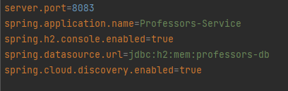

# **<u>Gestion-Absense-Java-JEE-Microservices-projet</u>"**

#### *Application basée sur une architecture micro-service qui permet de gérer les absences dans une école.*


---
### Cahier de charge
### Objectif du projet
Créer une application web JEE **" GESTION D'ABSENCE "** avec un rendu HTML coté client qui permet de :
* Gérer les professeurs (ajout / supression / détail)
* Gérer les etudiants (ajout / supression / détail)
* Gérer les cours (ajout / supression / détail)
* Gérer les absences des etudiants (ajout / supression / détail)
* sécuriser à l'aide de kaycloak 

### Architecture du projet
Le développement de cette application est basée sur deux parties avec l'utilisation d'une architecture microservice:
* Framework : **"SPRING"** coté **Backend**
* Framework : **"Angular"** coté **Frontend**


### Structure du projet
#### Backend
Dans l'ensemble **des microservices** qu'on va créer dans ce projet, on va utiliser la version **2.7.8 de Spring Boot** et la version **17 de Java**.

* pour les micro services **students** et **professors** ajouter les dependense suivantes
    * Lombok
    * Spring web
    * Rest repository
    * H2 database
    * Spring Boot Actuator
    * Spring DATA Jpa
    * Eureka Discovery Client
* pour les micro services **absence** et **cours** ajouter les dependense suivantes
    * Lombok
    * Spring web
    * Rest repository
    * H2 database
    * Spring Boot Actuator
    * Spring DATA Jpa
    * Eureka Discovery Client
    * Open Fein
    * Spring Hateoas
* pour le micro service **Gateway** ajouter les dependense suivantes
    * Spring boot actuator
    * Eureka discovery client
    * Gateway
* pour le micro service **Discovery** ajouter les dependense suivantes
    * Eureka server


### La structure du **service professeur**


Pour la creation des entities 
* class professor


Pour la creation des repositories
* interface professor


Pour la creation des controllers
* class ProfessorController


* ProfessorServiceApplication


* application properties



### La structure du **service students**


Pour la creation des entities
* class students


* class classroom


Pour la creation des DTOs

* class studentsDto


* class classroomDto 


Pour la creation des enums
* enum Gender


Pour la creation des mappers
* class StudentsMappers


Pour la creation des repositories

* interface StudentRepository


Pour la creation des controllers

* class StudentController


StudentServiceApplication


application properties


### La structure du **service cours**


Pour la creation des entities
* class Cours


* class Session


  pour la creation des models

* class classroom


* class professor


  pour la creation des repositories

* interface CoursRepository


* interface SessionRepository


  Pour la creation des services
* interface ClassroomRestService


* interface ProfessorRestService


  
* pour la creation des services

* interface ClassroomRestService


  
* interface ProfessorRestService


Pour la creation des controllers

* class CoursRestController


CoursServiceApplication


 application properties


### La structure du **service Absence**


pour la creation des entities

* class Absence


pour la creation des models

* class classroom


* class cours


* class professor


* class Student


Pour la creation des repositories
* interface AbsenceRepository


Pour la creation des Services
* interface CoursRestService


* interface ProfessorRestService


* interface StudentRestService


Pour la creation des Controller

* class AbsenceController


  AbsenceServiceApplication


application properties


### La structure du **service Gateway**


GatewayServiceApplication


application yml


La structure du **service Discovery**


DiscoveryServiceApplication


application properties


### Pour la partie sécurité nous avons utilisé keycloak


#### Frontend
éxécuter la commande pour creer le projet frontend
```shell
ng new  Absense-Management-Portal
```
Installer bootstrap
```shell
npm install bootstrap --save
npm install bootstrap-icons --save  
``` 


Creer l'ensemble des components
```shell
ng g c le nom du component
``` 
Creer l'ensemble des services
```shell
ng g s le nom du service
``` 


Nouveau etudiant


List etudiant


Detail etudiant


Liste cours


Detail cours


Liste absence


Detail absence


### RESULTAT DU PROJET


